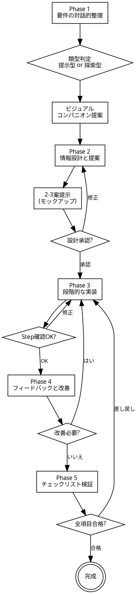

# ダッシュボードデザインガイド

## Overview

ダッシュボードの目的は**意思決定と行動を支援すること**。数値に基づいて事実を理解し、関係者の共通認識を広げ、より良い行動につなげる。見た目ではなく、ユーザーが必要な情報に最短でたどり着き、判断・行動できることがゴール。常に目的から逆算して設計する。

**このスキルの設計思想:**
- **教育ではなく示唆**: 原典は教育文書だが、このスキルが提供するのは判断の軸。AIがすでに知っている一般的な設計知識は書かれていない。ガイドブック固有の仕様と、目的から逆算するための原則だけを提供する。
- **テンプレートは材料であり完成品ではない**: output-templatesはデザインシステムのアトミックなパーツを提供する。AIがユーザーの目的に応じて組み立てる。テンプレートを脳死で適用するのではなく、目的に照らしてパーツを選び、構成する。
- **避けるべき2つの失敗**: 哲学のないテンプレート適用（形だけ整えて品質がない）と、ノウハウのない独自の工夫（ガイドブックの仕様を無視した自己流）。前者は一貫性があるが品質がなく、後者は品質を狙って一貫性を失う。

スキル使用時に宣言する: 「ダッシュボードデザインガイドを使って、対話しながら設計・構築していきます」

## The Iron Law

**設計承認なしに実装に入らない。実装の各ステップでユーザー確認を取る。**

骨格が定まらないうちに表層を詰めない。レイアウトが承認されるまで色・フォント・チャートの細部を作り込まない。

## When to Use

以下のキーワードやコンテキストでトリガーする:

- ダッシュボード, dashboard, データ可視化, data visualization
- KPI表示, metrics display, チャート設計, 指標の見える化
- モニタリング画面, monitoring screen, 行政データ
- データを可視化して意思決定を支援する画面を求めている場合（「ダッシュボード」という語がなくても）

## Process Flow

## ダッシュボードの2類型

これはガイドブック固有のフレーミングであり、Phase 1 の冒頭で判定する。

- **提示型（Presentational）**: 現状を基準と照らし合わせ、異常に素早く気づき、行動の必要性を判断する。KPIカード＋トレンドチャートが主体。操作は最小限。
- **探索型（Exploratory）**: 明確な判断基準がない事柄について、差分を発見し、源流を特定して掘り下げる。ユーザーは全体と部分を往復し、ビュー間の連動によって多角的にデータを探索し、段階的に詳細へたどり着く。ドメイン知識を前提とする。

判断がつかなければ提示型で始める。多くの場合、提示型を軸に探索型要素を必要に応じて追加する。

探索型の要素を含む場合は `references/interaction-patterns.md` を読み込み、インタラクションの原則とコンポーネントを参照する。

## Phase 1: 要件の対話的整理

**1問ずつ確認する。** 推測できるものは確認形で済ませる。選択肢形式を優先し、1メッセージ1質問を守る。

| 確認項目 | 確認すること |
|---------|------------|
| 目的（Why） | 何の意思決定・行動を支援するか |
| 必要な情報（What / So What） | 何を見て、何を判断・行動するか |
| 利用シーン（Who / When / Where） | 誰が・いつ・どのデバイスで見るか |
| 機能・粒度（How） | 必要な機能、データ粒度、更新頻度 |
| 制約 | データの欠損・更新頻度・分解能の限界 |
| 出力形式 | HTML / PowerPoint / Excel / Markdown |

要件が曖昧な場合は `references/requirements-worksheet.md` を参照。記入例は `examples/requirements-example.md` にある。

要件が出揃ったら、自ら設計判断を導き出し、方針として提示する。画面構成、情報の階層、比較軸の設計など、重要な設計判断をユーザーに示し、合意を得る。

Phase 1 完了後、Phase 2 に入る前にビジュアルコンパニオンを提案する。チャートの形やレイアウトの選択肢をブラウザで視覚的に比較・選択できる機能。この提案は単独のメッセージで送り、他の内容と混ぜない。ユーザーが承認したら `references/visual-companion.md` を読み込む。断られた場合はテキストのみで進める。

## Phase 2: 情報設計と提案

`references/design-principles.md`、`references/chart-selection.md`、`references/layout-grid.md` を読み込む。

4つのステップで進める:

1. **情報の一覧化**: 必要な指標・データ項目をリストアップし、ユーザーに過不足を確認する
2. **チャート割り当て**: 各指標に最適な表示方法を割り当てる。ビジュアルコンパニオンが有効な場合、1指標ずつ実データでChart.jsチャートを描画し、2-3案を見せてユーザーに選択させる。KPIカードを含む全指標で実施する（スキップ禁止）。ユーザーが追加パターンを要求したら生成して表示する
3. **インタラクション設計**（探索型の場合）: ユーザーがデータに対して「なぜ？」と問う箇所を特定し、その答えにたどり着くためのインタラクション（ドリルダウン、クロスフィルタリング、Detail-on-Demand等）を設計する。`references/interaction-patterns.md` を参照。ビジュアルコンパニオンが有効な場合、フィルタ配置などの選択肢もモックアップで見せる
4. **レイアウト提案**: 2-3パターンのレイアウト案を提示する（推奨理由とトレードオフを添える）。利用者の視点で各案を見直し、「この画面を見たユーザーが最短で判断・行動に到達できるか」を確認する。ビジュアルコンパニオンが有効な場合はタブ切り替えでモックアップを表示し、ユーザーに選択させる（HTML出力のみ）

**設計承認ゲート**: 「この情報構成とレイアウトで実装に進みます。よろしいですか？」 — 承認されるまで Phase 3 に進まない。

## Phase 3: 段階的な実装

骨格が定まらないうちに表層を詰めない。

テンプレートは材料として使う。目的に応じてパーツを選び、組み合わせ、調整する。テンプレートをそのまま貼り付けて終わりにしない。逆に、テンプレートの仕様（カラーパレット、タイポグラフィ、グリッド）を無視した独自の工夫もしない。

デジタル庁カラーパレットの適用は必須。仕様である。

`references/builder-prompts.md` を読み、Phase 1-2で決まった設計仕様を構造化テンプレートに埋め、各Stepのビルダーエージェントを起動する。自分では出力ファイルを書かない。ビルダーを起動し、出力をユーザーに見せ、フィードバックを次のビルダーに渡す。

**Step 1: 骨格レイアウト** — builder-prompts.md の Step 1テンプレートでビルダーを起動。→ ユーザー確認
**Step 2: チャートとデータの配置** — Step 1の出力とStep 2テンプレートでビルダーを起動。→ ユーザー確認
**Step 3: 仕上げ** — Step 2の出力とStep 3テンプレートでビルダーを起動。→ ユーザー確認

## Phase 4: フィードバックと改善

完成版をユーザーに見せる。

フィードバックを受けたら、まず**要望の背後にある理由**を理解する。フィードバックは評価すべき提案であって、従うべき命令ではない。理由を満たす最善の方法を考える。要望どおりの変更が最善とは限らない。

ダッシュボードの目的と矛盾するフィードバックには、矛盾の理由を技術的に説明し、代替案を提示する。

改善サイクルは必要な回数だけ繰り返す。

## Phase 5: チェックリスト検証

`references/checklist.md` を読み込み、全項目を確認する。

- 自動検証可能な項目（棒グラフの原点が0か、aria-labelがあるか、更新日が記載されているか等）は自己チェックし、結果を報告する
- 手動確認が必要な項目（利用者の体験に関する評価等）はユーザーに確認を促す
- 不合格項目があれば Phase 3 に差し戻して修正する

公開向けダッシュボードの場合は `references/summary-text-format.md` を読み込み、要約テキストを生成する。

## Common Rationalizations

| 言い訳 | 現実 |
|-------|------|
| 「要件は大体わかったから実装に入ろう」 | 設計承認ゲートを飛ばすと手戻りが倍になる |
| 「色は後で変えればいい」 | デジタル庁カラーパレットは仕様。後回しにすると全体を組み直す羽目になる |
| 「1画面に全部入れたほうが便利」 | 情報過多は判断を遅らせる。階層化とページ分割を検討する |
| 「チェックリストは形式的なものだ」 | 棒グラフの原点0やaria-labelの欠如は、データの誤解やアクセシビリティの欠落に直結する |
| 「フィードバックは全部そのまま反映すべき」 | 要望は評価すべき提案であって従うべき命令ではない。理由を理解し、最善策を選ぶ |
| 「テンプレートに沿えば品質は保証される」 | 一貫性と品質は別物。テンプレートは材料であり、目的に照らした判断なしに使えば形だけ整って中身がない |
| 「ガイドブックに載っていないから自由にやる」 | デザインシステムの仕様を無視した独自の工夫は一貫性を壊す。仕様の範囲内で目的に最適化する |

## Red Flags

以下に気づいたら、立ち止まって前のPhaseに戻る:

- 骨格レイアウトが決まっていないのに色やフォントを調整している → Phase 3 Step 1 に戻る
- ユーザーの確認を取らずに2ステップ以上進んでいる → 直前のステップに戻って確認を取る
- チャートの選定理由を説明できない → Phase 2 に戻って chart-selection.md を再参照
- 1画面の情報量が増え続けている → Phase 2 に戻って画面分割を検討
- アクセシビリティ対応を「後でやる」と判断している → Phase 3 Step 3 で必ず対応する
- テンプレートのコードをコピーしただけで、目的に応じた調整をしていない → 何のためにこの構成にしたのか説明できるか自問する
- デザインシステムの色やフォントを無視して独自の値をハードコードしている → design-system.md のCSS変数を使う

## リファレンスファイル一覧

| ファイル | 内容 | いつ読むか |
|---------|------|-----------|
| `references/requirements-worksheet.md` | 要件定義ワークシート。5W1H＋制約条件の整理テンプレート | Phase 1: 要件が曖昧なとき |
| `references/design-principles.md` | 情報選定4原則、ダッシュボード設計4原則、グラフ設計2原則 | Phase 2: 情報設計の判断基準として |
| `references/chart-selection.md` | チャートタイプの選定ガイド。指標・表・グラフの使い分け | Phase 2: チャートタイプを決めるとき |
| `references/interaction-patterns.md` | 探索型インタラクションの3原則とコンポーネント（ドリルダウン、クロスフィルタリング、Detail-on-Demand、タブナビゲーション） | Phase 2-3: 探索型要素を含む場合 |
| `references/visual-companion.md` | ブラウザベースのチャート・レイアウト比較。Step 2-4で実データ描画・モックアップ表示・タブ切り替え | Phase 2: ユーザーがビジュアルコンパニオンを承認した場合 |
| `references/layout-grid.md` | グリッドシステム、レイアウトパターン、フィルタ配置、レスポンシブ指針 | Phase 2-3: レイアウトを設計するとき |
| `references/color-palette.md` | カラーパレット全仕様。コントラスト比の段階的対応を含む | Phase 3: 実装するとき（必ず読む） |
| `references/accessibility.md` | アクセシビリティ要件の集約。色以外の識別手段、aria-label、キーボード操作 | Phase 3: 仕上げのとき（必ず読む） |
| `references/builder-prompts.md` | Phase 3ビルダーエージェントのプロンプトテンプレート。設計仕様テンプレート、出力形式別読み込みファイル対応表、3 Step分のビルダープロンプト | Phase 3: 実装開始時（必ず読む） |
| `references/output-templates.md` | 出力テンプレートのインデックス。5ファイルへの参照を含む | ビルダーエージェントが参照する。メインは直接読まない |
| `references/checklist.md` | ダッシュボード品質チェックリスト。自動検証可否フラグ付き | Phase 5: 検証時（必ず読む） |
| `references/summary-text-format.md` | ダッシュボード要約テキストのフォーマット | Phase 5: 公開向けダッシュボードの場合 |
| `examples/requirements-example.md` | 営業ダッシュボードの要件記入例 | Phase 1: 要件整理の参考として |
